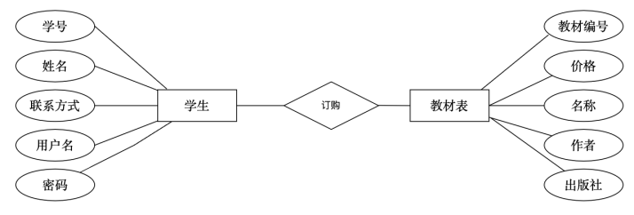
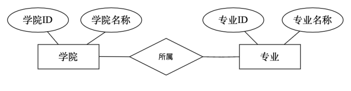
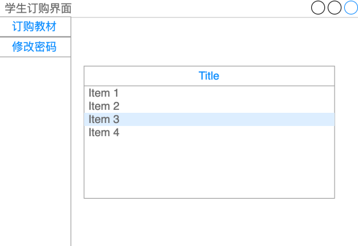
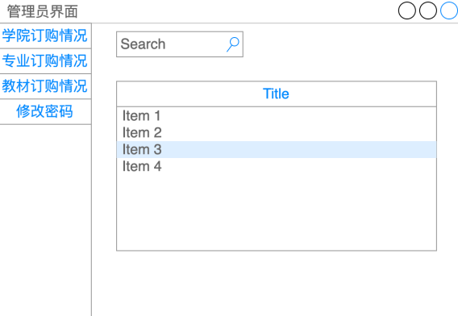

# 基于QT和Python的图书订购系统

- 项目背景
- 技术架构与技术栈
- 系统设计
    - 数据库设计
    - 前端UI设计
    - 后端逻辑设计
    - 自动测试框架
- Tasks

# 项目背景

项目将专注于开发一个大学图书订购管理系统，旨在通过此次项目设计，
将大学学习的数据库知识、软件设计知识和代码编写知识应用于实际。

大学图书订购管理系统管理系统，采用电子自助系统，解决手动记录学生订购教材问题，
应用涵盖学生根据不同专业和学期订购教材的需求和管理员查询功能，
包括特点学院、特点专业的订购情况、教材总体的订购信息。
此外，对于管理员，还应该包含教材总体订购情况的导出功能，
以便管理员能够简单直观的获取对应书籍的订购数量，简化教材订购流程。
最后，对于管理员，还应该设计数据的备份与恢复功能，来增加系统的稳定性与健壮性。

# 技术架构与技术栈

项目采用MVC模式，使用QT完成UI的行为的设计，使用Python处理功能逻辑和数据库交互。

## 技术栈

- 开发工具
    - 版本控制: Git (远程仓库GitHub/Gitee)
    - IDE：PyCharm
    - PyInstaller: 打包应用程式
- 前端技术
    - QT
    - pyqt5
    - Qt Creator (Qt Designer)
- 后端技术
    - Python
    - MySQL/Postgres 关系数据库
    - pymysql
    - pandas
    - pytest 单元测试
    - Ruff & pyrefly：格式化和静态代码分析

# 系统设计

## 数据库设计

根据需求，大致确定至少会包含 5 个表，分别是管理员表、学院表、专业表、学生表和教材表。
此外通过经验判断，很有可能还需要建立一个订单表。

### ER图

### 学生和专业


### 学生和图书



### 专业和学院



### 管理员和学院


## 前端UI设计

### 学生订购界面-概念原型



### 管理员界面-概念原型



## 后端逻辑设计

- 每个界面的行为，单独封装
- 数据库工具函数，单独封装

## Tools

### Claude Conversation Extractor Tool

```bash
pip install claude-conversation-extractor
```

```bash
# Interactive mode with UI (easiest)
claude-start

# CLI mode
claude-extract

```

## 自动测试框架

- 使用 pytest 测试框架
- 同时引入 Claude Code 进行测试代码辅助生成
- Claude Code 配置大陆的 minmax 2 模型 API

```bash
claude

claude 
```

# Tasks

- [x] 完成开发工具和仓库初始化
- [x] 完成关系数据库设计
- [x] 使用Qt设计学生订购UI
- [x] 使用Qt设计管理员订购UI
- [x] 使用Qt设计登陆UI
- [x] 使用pyqt将UI整合成一个应用
- [x] 使用pymysql，完成后端和数据库交互
- [x] 完成前后端交互
- [x] 完成高级 导出、备份和恢复功能
- [x] Ruff & pyrefly 替换 Black & pylint
- [x] pytest 单元测试
- [ ] 测试用户体验
- [ ] 调整与优化应用
- [ ] PyInstaller 打包